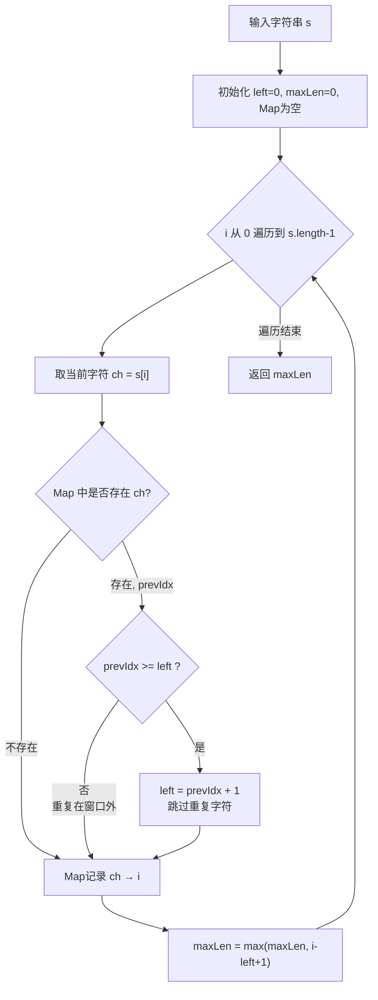
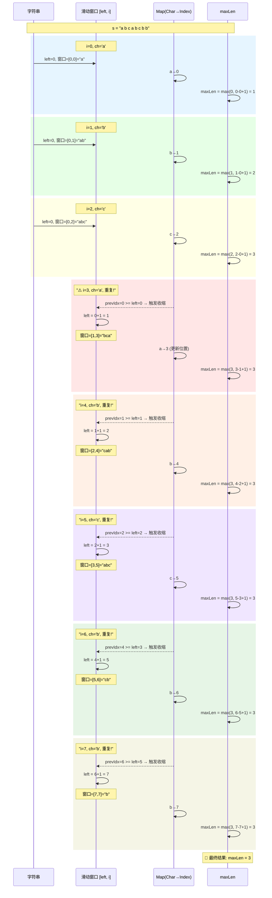
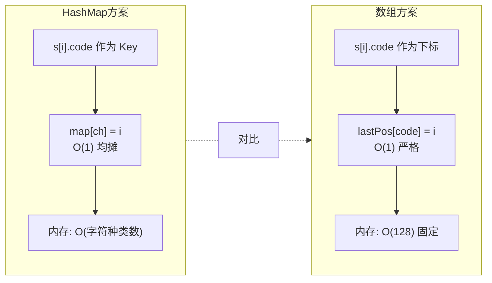
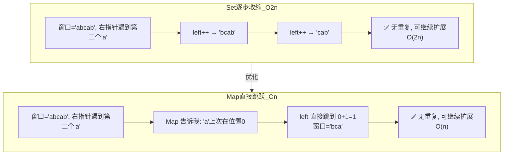

# 3. 无重复字符的最长子串 — 多解 + Mermaid 图解

## 一、字串/子数组问题的通用思考方向

遇到「子串/子数组 + 满足某条件 + 求最长/最短」这类题，通常有以下几个核心方向：

| 方向 | 适用场景 | 典型例题 |
|------|---------|---------|
| **滑动窗口** | 窗口内满足单调性（扩大→更容易不满足，缩小→更容易满足） | 本题、76最小覆盖子串、209长度最小子数组 |
| **前缀和 + 哈希** | 和/异或/奇偶等可差值化的条件 | 560和为K的子数组、525连续数组 |
| **动态规划** | 子问题有递推关系 | 5最长回文子串、647回文子串数 |
| **双指针（中心扩展）** | 回文类型 | 5最长回文子串 |
| **单调栈/队列** | 涉及大小比较 | 239滑动窗口最大值 |

**本题（无重复字符最长子串）核心特征**：要求「无重复」→ 窗口扩大时可能"破坏条件"（出现重复），破坏后需要缩小窗口恢复条件 → **典型的滑动窗口**。

---

## 二、多种解法对比

### 解法1：暴力枚举 O(n³)

枚举所有子串 `[i, j]`，逐个判断是否有重复字符。不做推荐。

### 解法2：滑动窗口 + HashSet O(2n)

用 Set 维护窗口内字符，遇到重复时 `while` 循环左指针逐步右移。

### 解法3：滑动窗口 + HashMap（推荐）O(n)

用 Map 记录每个字符**上一次出现的位置**，遇到重复时左指针**直接跳跃**，不需要一步步挪。

### 解法4：滑动窗口 + 数组（ASCII 128/256）O(n)

因为字符集有限（ASCII），可用 `IntArray(128)` 代替 HashMap，常数级更快。

---

## 三、代码实现

### 原代码问题

```kotlin
// ❌ 问题代码
val map = HashMap<Int, String>()  // 泛型错误：应为 HashMap<Char, Int>
var prev = map[char]              // prev 类型为 String?，无法与 left 比较
```

### 解法3：HashMap 版（修正后）

```kotlin
fun lengthOfLongestSubstring(s: String): Int {
    val map = HashMap<Char, Int>()  // Char → 上次出现的位置
    var left = 0
    var maxLen = 0
    for (i in s.indices) {
        val ch = s[i]
        val prevIdx = map[ch]
        if (prevIdx != null && prevIdx >= left) {
            left = prevIdx + 1  // 跳到重复字符的下一个位置
        }
        map[ch] = i
        maxLen = maxOf(maxLen, i - left + 1)
    }
    return maxLen
}
```

### 解法4：数组优化版（最快，仅限 ASCII）

```kotlin
fun lengthOfLongestSubstring(s: String): Int {
    val lastPos = IntArray(128) { -1 }  // ASCII 覆盖所有英文字符
    var left = 0
    var maxLen = 0
    for (i in s.indices) {
        val code = s[i].code
        if (lastPos[code] >= left) {
            left = lastPos[code] + 1
        }
        lastPos[code] = i
        maxLen = maxOf(maxLen, i - left + 1)
    }
    return maxLen
}
```

### 解法2：HashSet 逐步收缩版（用于对比理解）

```kotlin
fun lengthOfLongestSubstring(s: String): Int {
    val set = HashSet<Char>()
    var left = 0
    var maxLen = 0
    for (i in s.indices) {
        val ch = s[i]
        while (set.contains(ch)) {
            set.remove(s[left])
            left++  // 逐步右移，直到删除重复字符
        }
        set.add(ch)
        maxLen = maxOf(maxLen, i - left + 1)
    }
    return maxLen
}
```

---

## 四、Mermaid 图解

### 4.1 整体算法流程图



### 4.2 以 "abcabcbb" 为例 — 滑动窗口动态推演



### 4.3 HashMap vs 数组 两种实现对比



### 4.4 核心思想：左指针"跳跃"vs"逐步"



### 4.5 滑动窗口可视化（窗口在字符串上的移动过程）

```mermaid
gantt
    title 滑动窗口在 "abcabcbb" 上的变化过程
    dateFormat X
    axisFormat %s

    section 窗口
    [0,0]="a"     :done, 0, 1
    [0,1]="ab"    :done, 1, 2
    [0,2]="abc"   :done, 2, 3
    [1,3]="bca"   :done, 3, 4
    [2,4]="cab"   :done, 4, 5
    [3,5]="abc"   :done, 5, 6
    [5,6]="cb"    :done, 6, 7
    [7,7]="b"     :done, 7, 8

    section maxLen
    1             :milestone, 1, 0
    2             :milestone, 2, 0
    3             :milestone, 3, 0
    3(不变)       :milestone, 4, 0
    3(不变)       :milestone, 5, 0
    3(不变)       :milestone, 6, 0
    3(不变)       :milestone, 7, 0
    3(不变)       :milestone, 8, 0
```



---

## 五、总结

| 维度 | 说明 |
|------|------|
| **核心思想** | 滑动窗口 + 哈希记录位置，遇重复时 left 跳跃 |
| **时间复杂度** | O(n)，每个字符被右指针访问一次，左指针最多跳一次 |
| **空间复杂度** | O(min(n, 字符集大小)) |
| **HashMap 版** | 通用性强，适用 Unicode 字符集 |
| **数组版** | 仅适用 ASCII，但无哈希开销，速度更快 |
| **与你的代码差异** | Map 泛型应为 `<Char, Int>` 而非 `<Int, String>` |

### 口诀记忆

> **窗口右扩遇重复，查表定位跳左沿；**
> **更新位置算长度，遍历一遍得答案。**
